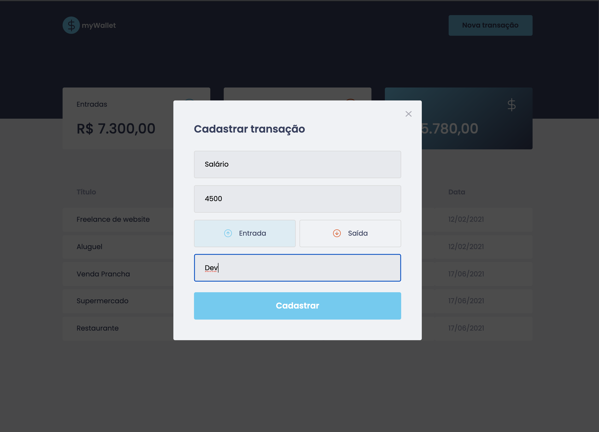
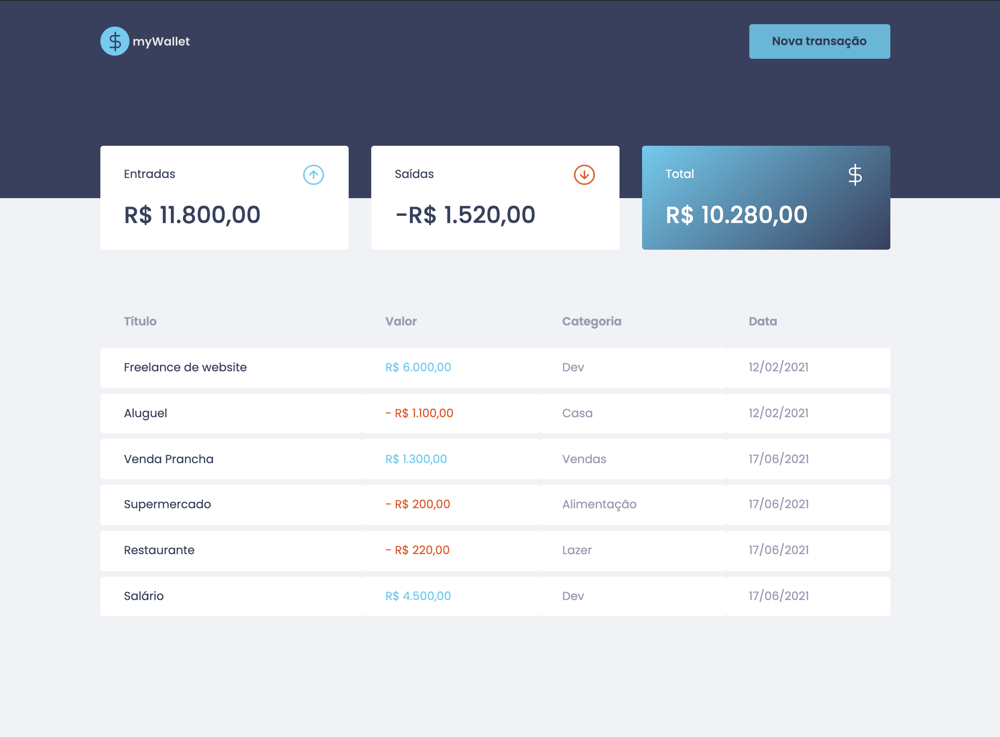

<h1 align="center">myWallet</h1>
<p align="center">Aplicação front-end para registro de transações financeiras, com cálculo do total de saídas, entradas e balanço financeiro.</p>

<p align="center">:coffee:</p>

<p align="center">
  <a href="#principais-funcionalidades">Funcionalidades</a> &#xa0; | &#xa0; 
  <a href="#status">Status</a> &#xa0; | &#xa0;
  <a href="#tecnologias">Tecnologias</a> &#xa0; | &#xa0;
  <a href="#fluxo-em-imagens">Imagens</a> &#xa0; &#xa0; | &#xa0;
  <a href="#executando-o-projeto-na-sua-máquina">Executando</a> &#xa0; &#xa0;
</p>

---

</br>
<h2>Principais Funcionalidades</h2>
- Cadastro de transações com nome, tipo, valor e categoria</br>
- Sumário com o cálculo do total de entradas, saídas e balanço</br>
- Formulário de cadastro de novas transações num modal utilizando react-modal</br>
- Criação de fake API com MirageJS simulando um servidor com as rotas GET e POST de busca e criação de transações</br></br>

<h2>Status</h2>
Finalizada</br></br>

<h2>Tecnologias utilizadas</h2>
- TypeScript</br>
- React</br>
- Styled Components</br>
- MirageJS</br></br>

<h2>Imagens</h2>

| Dashboard |
|-------|
||

| Formulário de cadastro de nova transação | Dashboard atualizado com a nova transação |
|-------|-------|
|||

</br>
<h2>Executando o projeto na sua máquina</h2>

Você deve rodar os seguintes comandos na pasta do projeto:
```bash
# Install dependencies
$ yarn

# Run the project
$ yarn start

# The server will initialize in the <http://localhost:3000>
```


